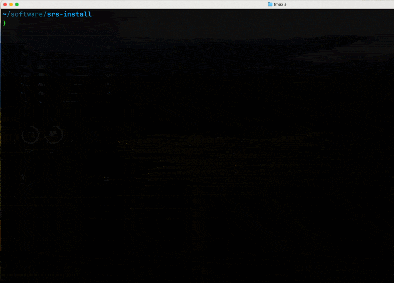

# srs-daq - A data acquisition program for SRS FEC & VMM3

SRS-DAQ is a project containing a command line tool `srs_control` and additional library APIs that can be used to communicate with SRS system and interpret the received data in your own program.

Please check the full documentation of this project: [SRS-DAQ documentation](<https://yanzhaow.github.io/srs-daq/>).

## `srs_control` preview

## Acknowledgments

- A lot of information was used from the existing codebase of the VMM slow control software [vmmsc](https://gitlab.cern.ch/rd51-slow-control/vmmsc.git).
- The understanding of the communication protocol was helped from [srslib](https://github.com/bl0x/srslib).
